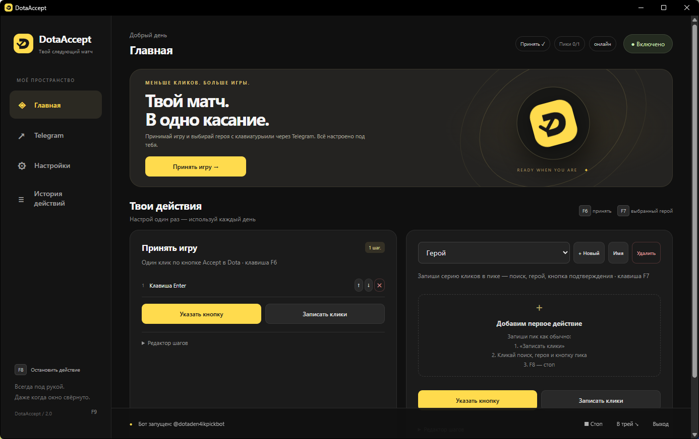
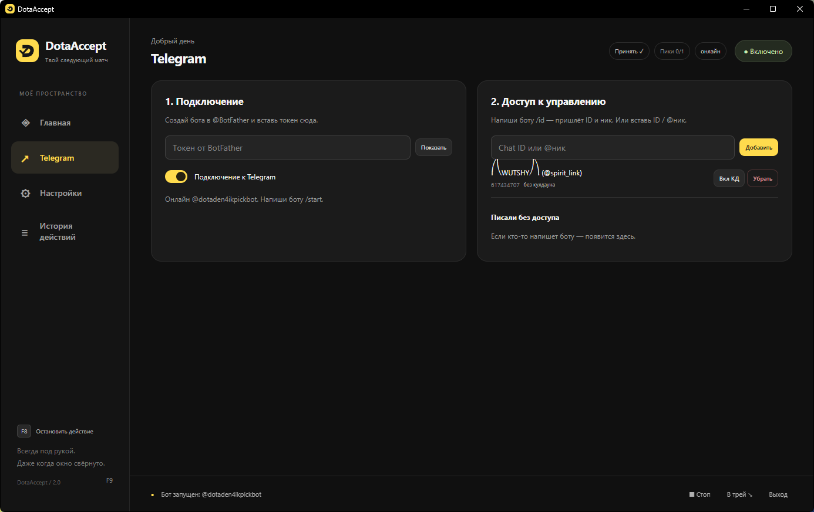
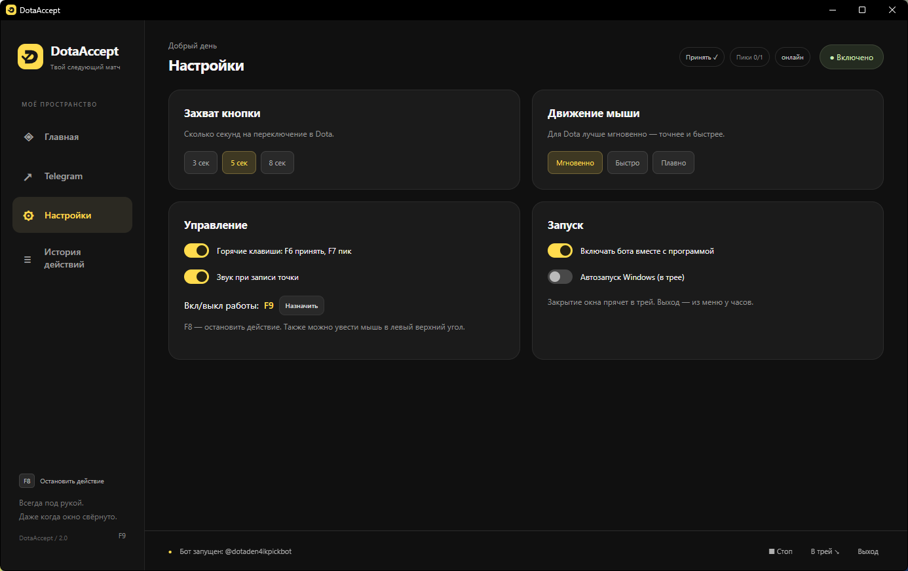
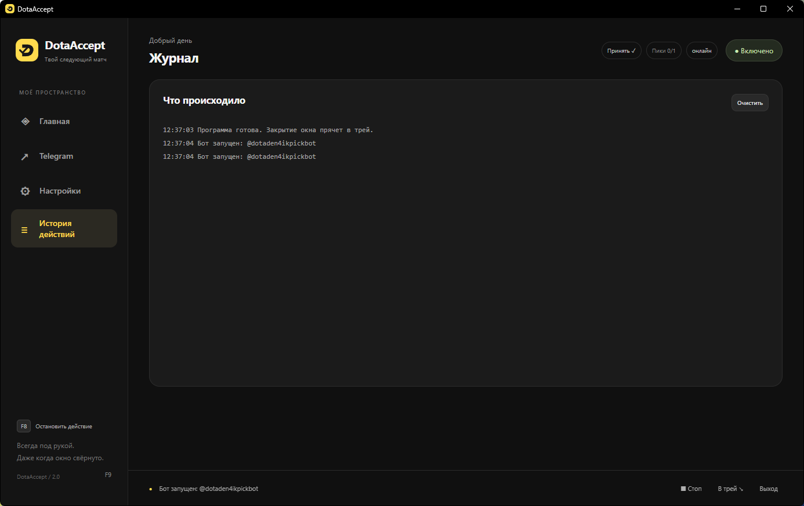

# DotaAccept

**Меньше кликов. Больше игры.**

Принимай матч и выбирай героя с клавиатуры или через Telegram.

**Русский** · [English](README.en.md)

[**Скачать для Windows**](https://github.com/wuttashi1/DotaAccept/releases/latest) · [Первый запуск](#первый-запуск) · [Скриншоты](#скриншоты) · [Сообщить о проблеме](https://github.com/wuttashi1/DotaAccept/issues)

## Твой матч. В одно касание.

DotaAccept — приложение для Windows, которое выполняет настроенные действия для принятия матча и выбора героя в Dota 2. Укажи кнопку или запиши последовательность кликов, а затем запускай её горячей клавишей или через своего Telegram-бота.

- **Принятие матча** — отдельное действие с запуском по F6.
- **Профили героев** — сохраняй последовательности кликов и запускай выбранный профиль по F7.
- **Telegram** — подключай своего бота и управляй списком пользователей с доступом.
- **Настройка действий** — запись кликов, редактор шагов, задержка захвата и режим движения мыши.
- **Работа в трее** — скрывай окно, включай автозапуск Windows и запуск бота вместе с приложением.
- **Контроль выполнения** — журнал действий, остановка по F8 и включение/пауза по F9.

> Это репозиторий готовой сборки и документации. Полный исходный код приложения в него не входит. Интерфейс приложения — на русском; документация доступна на русском и английском.

## Первый запуск

1. Скачай **DotaAccept-2.0-Windows-x64.zip** из [последнего релиза](https://github.com/wuttashi1/DotaAccept/releases/latest).
2. Распакуй **весь архив** в отдельную папку. `DotaAccept.exe` и `_internal` должны оставаться рядом.
3. Запусти `DotaAccept.exe`. Python устанавливать не нужно.
4. На главной странице в блоке принятия матча нажми **«Указать кнопку»** (либо **«Настроить принятие»**, если действие ещё не настроено).
5. Переключись в Dota 2, наведи курсор на нужную кнопку и дождись сигнала захвата. Задержка выбирается в настройках: 3, 5 или 8 секунд.
6. Нажми **F6**, чтобы выполнить действие. Для выбора героя создай профиль, нажми **«Записать клики»**, выполни нужные клики и заверши запись клавишей **F8**. Выбранный профиль запускается по **F7**.

**Требования:** Windows 10/11 x64 и Microsoft Edge WebView2 Runtime. При запуске действия из окна приложения предусмотрены 3 секунды на переключение в игру.

Действия используют настроенные позиции и последовательности кликов. После изменения разрешения или расположения элементов игры проверь и при необходимости запиши их заново. Принятие запускается пользователем; автоматическое обнаружение найденного матча здесь не заявлено.

## Горячие клавиши

- **F6** — принять матч.
- **F7** — выполнить сценарий выбранного героя.
- **F8** — остановить действие / завершить запись кликов.
- **F9** — включить или приостановить работу; сочетание можно переназначить в настройках.

Для экстренной остановки также можно увести мышь в левый верхний угол экрана. Горячие клавиши включаются в настройках.

## Подключение Telegram

1. Создай бота через **@BotFather** в Telegram и получи его токен.
2. Открой раздел **Telegram**, вставь токен и включи подключение.
3. Напиши своему боту `/start`, затем `/id`, чтобы получить свой ID.
4. Добавь ID или `@ник` в блоке **«Доступ к управлению»**.

Токен и персональные настройки хранятся в локальном `config.json`. Не публикуй этот файл и не передавай его другим людям. В скачиваемый архив личные настройки автора не включены. Данные Telegram на скриншотах показаны как пример — для работы используй собственного бота.

## Скриншоты

### Telegram — подключение и доступ

### Настройки — под твой ритм

### Журнал — история действий

## Трей и перенос настроек

Крестик закрытия скрывает окно в системный трей. Для полного завершения выбери **«Выход»**. Повторный запуск возвращает окно из трея.

Для переноса настроек закрой обе копии приложения и скопируй свой `config.json` рядом с новым EXE. После переноса перевключи автозапуск, если он использовался. Храни резервную копию конфигурации приватно: она может содержать токен бота.

## Обратная связь

Создай [Issue](https://github.com/wuttashi1/DotaAccept/issues) с описанием проблемы, версией Windows и шагами воспроизведения. Перед отправкой скриншотов и журналов убери токены и личные данные.

---

**DotaAccept · Ready when you are.**

Неофициальный проект. Не связан с Valve. Dota 2 — товарный знак Valve Corporation.

